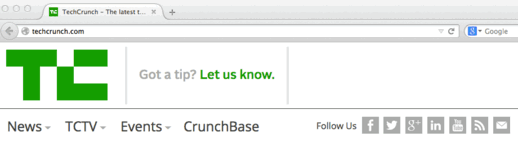

# O que é
Esta funcionalidade permite a você puxar feed RSS de sites e blogs automaticamente. RSS é uma fonte de conteúdo padronizada para a WEB (Feed) e é usado principalmente em blogs, portais de notícias, sites que geram bastante conteúdo.

# Importante
O ícone padrão é parecido com esse laranja que está na imagem abaixo e para conseguir a URL e utilizá-la na Aba, basta clicar nele. Os links normalmente parecem com:
https://www.seublog.com.br/feed/ ou http://www.seublog.com.br/rss

# Passo a passo

1. Preencha o campo com uma URL de feed RSS válida;
2. Para finalizar, clique em **Salvar Edição**;
3. Caso queira, renomeie a funcionalidade e altere a imagem do ícone.
